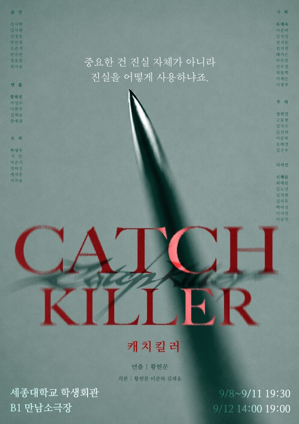
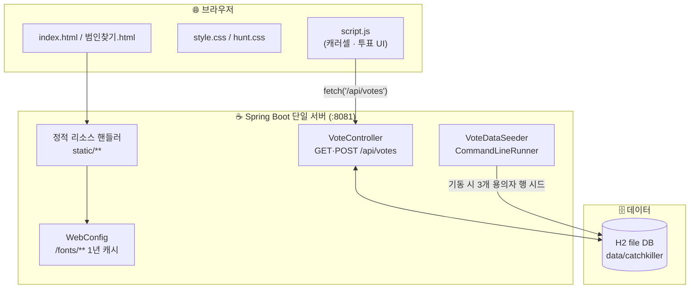

# 🔪 캐치킬러 — 게스트하우스 살인사건
catchkiller.vercel.app -> 핸드폰 기준으로 만들었으니 핸드폰으로 접속하시길 바랍니다

<p align="center">
  
</p>

<p align="center">
  세종극회 제 90회 정기공연 《캐치킬러》 프로모션 사이트<br>
  관객이 직접 사건을 추리하고 범인을 지목하는 <b>참여형 추리극</b>
</p>

<p align="center">
  
  
  
  
</p>

---

## 🎭 소개

게스트하우스에서 벌어진 살인 사건. 용의자는 셋 — 관객은 시놉시스와 각 인물의 진술을 읽고,
누가 진범인지 투표로 지목한다. 이 저장소는 그 공연을 홍보하고 관객 참여(투표)를 받는 웹사이트다.

빌드 도구나 프론트엔드 프레임워크 없이, **Spring Boot가 정적 파일을 서빙하고 투표 API만 담당하는**
가벼운 구조로 만들어졌다.

## ✨ 주요 기능

- **인트로 스크램블 애니메이션** — 글자가 무작위로 조합되며 등장하는 도입부
- **CAST / SUSPECTS 카드 캐러셀** — 등장인물·용의자를 넘겨보는 커버플로우 스타일 카드, 클릭 시 뒤집혀 진술/검거 사진 공개
- **캐스팅 일정 모달** — 회차별 배우 배정을 담은 표를 페이지 이탈 없이 확인
- **실시간 배심원 투표** — 방문자가 용의자를 선택해 투표, 서버(H2 DB)에 집계 저장
- **범인 찾기 서브페이지** — 세종극회 이전 공연 포스터를 마퀴로 훑어보는 별도 페이지
- 모바일 우선으로 설계된 반응형 레이아웃

## 🛠 기술 스택

| 영역 | 사용 기술 |
|---|---|
| Backend | Spring Boot 4.1 (Java 21), Spring Data JPA |
| Database | H2 (파일 기반) |
| Frontend | 순수 HTML / CSS / JavaScript (빌드 스텝 없음) |

## 🏗 시스템 아키텍처

빌드 도구도, 별도 API 서버도 없다 — Spring Boot 단일 프로세스가 정적 파일 서빙과 투표 API를 함께 처리하고, 데이터는 파일 기반 H2에 저장된다.



- **클라이언트**: 빌드 스텝이 없는 순수 HTML/CSS/JS. `script.js` 하나가 카드 캐러셀(coverflow)과 투표 UI 상태(`localStorage`의 `catchkiller_myvote`)를 모두 처리한다.
- **서버**: `com.sejong.catchkiller.vote` 패키지 하나에 도메인 로직이 전부 들어있다 — `VoteController`가 API 2개(`GET`/`POST /api/votes`)만 노출하고, `VoteDataSeeder`가 기동 시 용의자 3명 행을 보장한다.
- **정적 리소스**: 별도 CDN 없이 Spring Boot의 리소스 핸들러가 `static/`을 그대로 서빙하며, `WebConfig`가 `/fonts/**` 요청에만 1년짜리 캐시 헤더를 얹어 나머지 정적 파일(dev 재검증용 no-cache)과 다르게 취급한다.
- **데이터**: 별도 DB 서버 없이 로컬 디스크의 H2 파일(`./data/catchkiller`)을 그대로 사용 — 네트워크 홉이 없어 조회/집계 지연이 거의 없다.

## ⚡ 성능

프레임워크·번들러가 없는 만큼 최적화도 빌드 파이프라인이 아니라 캐싱 정책과 자산 크기 관리로 이뤄진다.

- **캐싱 이원화** — 기본은 `spring.web.resources.cache.cachecontrol.no-cache=true`로 정적 파일을 매번 재검증시켜 개발 중 수정 사항이 즉시 반영되게 했다(모바일 브라우저의 공격적인 캐싱 대응 포함). 반면 자주 안 바뀌는 웹폰트만 `WebConfig`에서 `Cache-Control: public, max-age=31536000`(1년)으로 예외 처리해, 재방문 시 네트워크 요청 없이 캐시에서 바로 로드된다.
- **경량 API** — 투표 API는 엔드포인트 2개, 로직은 단순 증감뿐이라 요청당 처리 지연이 거의 없고, H2가 파일 기반이라 별도 DB 왕복도 없다.
- **프레임워크 없는 클라이언트** — 캐러셀·투표 UI를 순수 JS 하나로 처리해 파싱/실행 비용과 초기 번들 오버헤드가 없다.
- **알려진 병목 (개선 여지)**
  - `fonts/`의 웹폰트가 TTF 원본 그대로 들어 있어 합계 약 15MB(`Shilla_Culture_M.ttf` 8.2MB, `ChosunCentennial.ttf` 5.1MB, `Songam.ttf` 1.6MB)에 달한다. WOFF2로 변환하면 초기 페인트 지연을 가장 크게 줄일 수 있는 지점이다.
  - `posters/`의 일부 PNG(`beach-parasol.png` 1MB, `haeeohwa.png` 690KB, `nagibang.png` 654KB)가 JPG 대비 용량이 커서, 여러 장을 한 번에 흘려보내는 히어로/범인찾기 마퀴의 초기 로드에 영향을 준다.
  - ``에 `loading="lazy"`가 아직 전면 적용되어 있지 않아, 뷰포트 밖 캐러셀 카드·용의자 사진까지 페이지 진입 시 한 번에 요청된다.

## 🚀 로컬 실행

```bash
cd backend
./mvnw.cmd spring-boot:run   # Windows
./mvnw spring-boot:run       # macOS / Linux
```

기본 접속 주소: `http://localhost:8080` (환경에 따라 `application.properties`의 `server.port` 참고)

정적 리소스는 빌드 없이 바로 서빙되므로, `static/` 아래 HTML/CSS/JS를 수정하고 새로고침하면 바로 반영된다.

## 📁 프로젝트 구조

```
backend/
└─ src/main/
   ├─ java/com/sejong/catchkiller/vote/   # 투표 API (GET/POST /api/votes)
   └─ resources/
      ├─ application.properties
      └─ static/
         ├─ index.html          # 메인 페이지
         ├─ 범인찾기.html         # 서브 페이지
         ├─ style.css / hunt.css
         ├─ script.js
         ├─ cast/                # 배우 프로필/검거 사진
         └─ posters/             # 포스터 이미지
```

## 🎟 공연 정보

| | |
|---|---|
| **일시** | 9.8 – 9.11 19:30 · 9.12 14:00 / 19:00 |
| **장소** | 세종극회 소극장 |
| **러닝타임** | 100분 |
| **관람등급** | 전체 이용가 |
| **티켓** | 6,000원 |
| **연출** | 황현문 |

📮 예매: [linktr.ee/sejongxdrama](https://linktr.ee/sejongxdrama)
📷 인스타그램: [@catch_killer_26](https://www.instagram.com/catch_killer_26/)

---

<p align="center"><sub>© 2026 세종극회 · SINCE 1979</sub></p>
